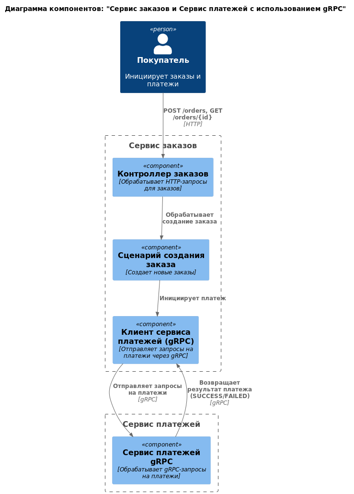

# Отчет с полным описанием шагов выполнения, приложенными диаграммами и описанием каждого микросервиса

## 1. Выбор системы:

> - Выберите систему или приложение, которое вы будете проектировать.

Для проектирования была выбрана система онлайн-торговли, которая предоставляет возможность пользователям просматривать
товары, оформлять заказы и осуществлять платежи.

---

## 2. Анализ функциональности:

> - Составьте список ключевых функций вашей системы.
> - Выделите независимые модули для каждой функции.

### Список ключевых функций системы

1. Управление пользователями
2. Управление каталогом товаров
3. Обработка заказов
4. Обработка платежей
5. Управление запасами
6. Уведомления
7. Аналитика

### Независимые модули для каждой функции

1. **Модуль управления пользователями:**
    - Реализация регистрации, аутентификации и управления профилем пользователей.

2. **Модуль управления каталогом:**
    - Управление данными о товарах, их поиском и обновлением.

3. **Модуль обработки заказов:**
    - Логика создания, проверки и управления заказами, а также резервирования товаров.

4. **Модуль обработки платежей:**
    - Управление интеграцией с платёжными шлюзами и обработка транзакций.

5. **Модуль управления запасами:**
    - Контроль остатков, взаимодействие с поставщиками и обновление данных о складе.

6. **Модуль уведомлений:**
    - Отправка внутренних и внешних уведомлений пользователям и сервисам.

7. **Модуль аналитики:**
    - Сбор данных, их хранение и предоставление в виде аналитических отчётов.

---

## 3. Выделение микросервисов:

> - Создайте два микросервиса, которые решают определенную задачу, будь то управления платежами или обработки заказов.
> - Каждый микросервис должен **имитировать** одну из следующих функциональностей.
>   - Сервис обработки заказов: обрабатывает заказы от пользователей.
>   - Сервис управления платежами: отвечает за финансирование и транзакции.
>   - Сервис отслеживания состояния: позволяет пользователям отслеживать состояние своих заказов.
>   - Сервис отзывов: позволяет пользователям оставлять и читать отзывы.
>   - Убедитесь, что микросервисы минимально зависят друг от друга.

### Микросервисы системы

1. Микросервис управления пользователями (User Service)
2. Микросервис управления каталогом (Catalog Service)
3. Микросервис обработки заказов (Order Service)
4. Микросервис обработки платежей (Payment Service)
5. Микросервис управления запасами (Inventory Service)
6. Микросервис уведомлений (Notification Service)
7. Микросервис аналитики (Analytics Service)

Каждый из микросервисов будет автономным, со своими собственными базами данных и интерфейсами, что обеспечит минимальную
связанность.

### Микросервисы, выбранные для реализации **имитации** функциональностей системы

Для реализации gRPC взаимодействия между микросервисами выбраны следующие два микросервиса:

- **Микросервис обработки заказов (Order Service):**
    - Создание и управление заказами.
    - Отслеживание статуса заказов.

- **Микросервис обработки платежей (Payment Service):**
    - Проведение платежей через платёжные шлюзы.
    - Проверка и подтверждение транзакций.


диаграмма компонентов С4 (выбранные микросервисы)


диаграмма последовательности взаимодействия сервисов по протоколу gRPC 


---

## 4. Определение интерфейсов взаимодействия:

> - Создайте файлы .proto для каждого сервиса
> - Определите gRPC методы для каждого сервиса, включая запросы и ответы.
> - Используйте сериализацию данных в формате Protocol Buffers.
 
### Определение интерфейсов взаимодействия для gRPC

### 1. **Файл `.proto` для Order Service**

Определим интерфейсы для микросервиса обработки заказов.

```proto
syntax = "proto3";

package orderservice;

// Сервис для работы с заказами
service OrderService {
    // Создание нового заказа
    rpc CreateOrder(CreateOrderRequest) returns (CreateOrderResponse);
}

// Сообщения для OrderService
message CreateOrderRequest {
    string user_id = 1;                  // ID пользователя
    repeated OrderItem items = 2;        // Список товаров
}

message CreateOrderResponse {
    string order_id = 1;                 // ID созданного заказа
    string status = 2;                   // Статус заказа
}

// Описание товара в заказе
message OrderItem {
    string product_id = 1;               // ID товара
    int32 quantity = 2;                  // Количество
    float price = 3;                     // Цена за единицу товара
}

```

### 2. **Файл `.proto` для Payment Service**

Определим интерфейсы для микросервиса обработки платежей.

```proto
syntax = "proto3";

package paymentservice;

// Сервис для обработки платежей
service PaymentService {
  // Обработка платежа
  rpc ProcessPayment(ProcessPaymentRequest) returns (ProcessPaymentResponse);
}

// Сообщения для PaymentService
message ProcessPaymentRequest {
  string order_id = 1;                 // ID заказа
  double amount = 2;                    // Сумма платежа
}

message ProcessPaymentResponse {
  string transaction_id = 1;           // ID транзакции
  string status = 2;                   // Статус транзакции (SUCCESS, FAILED)
}

```

---

## 5. Настройка инфраструктуры с Docker:

> - Создайте Dockerfile для каждого микросервиса, указывая необходимые зависимости.
> - Напишите файл docker-compose.yml для развертывания всех сервисов вместе, включая их зависимости и конфигурации

Order Service Dockerfile:
```dockerfile
FROM eclipse-temurin:17-jdk

WORKDIR /app

# Копируем файл сборки JAR в контейнер
COPY target/grpc-order-service*.jar order-service.jar

# запуск JAR
CMD ["java", "-jar", "order-service.jar"]
```
Payment Service Dockerfile:
```dockerfile
FROM eclipse-temurin:17-jdk

WORKDIR /app

# Копируем файл сборки JAR в контейнер
COPY target/grpc-payment-service*.jar payment-service.jar

# запуск JAR
CMD ["java", "-jar", "payment-service.jar"]

```
docker-compose.yml
```yaml
version: '3.8'

services:
  order-service:
    build:
      context: ./order-service
      dockerfile: Dockerfile
    ports:
      - "8080:8080"
    environment:
      - PAYMENT_SERVICE_HOST=payment-service
      - PAYMENT_SERVICE_PORT=9090
    depends_on:
      - payment-service
    networks:
      - app-network

  payment-service:
    build:
      context: ./payment-service
      dockerfile: Dockerfile
    ports:
      - "9090:9090"
    networks:
      - app-network

networks:
  app-network:
    driver: bridge


```

---

## 6. Развертывание и тестирование:

> - Используйте Postman или gRPC client для тестирования взаимодействия между сервисами
### Тестирование Order Service
Метод CreateOrder

Запрос:
```json
{
  "user_id": "user123",
  "items": [
    {
      "product_id": "p1",
      "quantity": 2,
      "price": 10.5
    },
    {
      "product_id": "p2",
      "quantity": 1,
      "price": 5.0
    }
  ]
}

```
Ожидаемый результат:
```json
{
  "order_id": "2c2551a2-7eeb-4df8-a741-1de113995532",
  "status": "CONFIRMED"
}
```


### Тестирование Payment Service
метод ProcessPayment

Запрос:
```json
{
    "transactionId": "txn123",
    "amount": 100.50,
    "orderId": "12345"
}
```
Ожидаемый результат:
```json
{
  "transaction_id": "cb64e2da-bd55-4adf-8bf1-1eab054de864",
  "status": "SUCCESS"
}
```

---

### Ожидаемый результат

> - Развернутая система: все микросервисы развернуты и работают в Docker-контейнерах.
> - Тестовое взаимодействие: успешные тесты на gRPC вызовы между сервисами.
> - Отчет с полным описанием шагов выполнения, приложенными диаграммами и описанием каждого микросервиса в формате PDF.


[репозиторий на GitHub](https://github.com/Lehater/msa-grpc-service-example)


